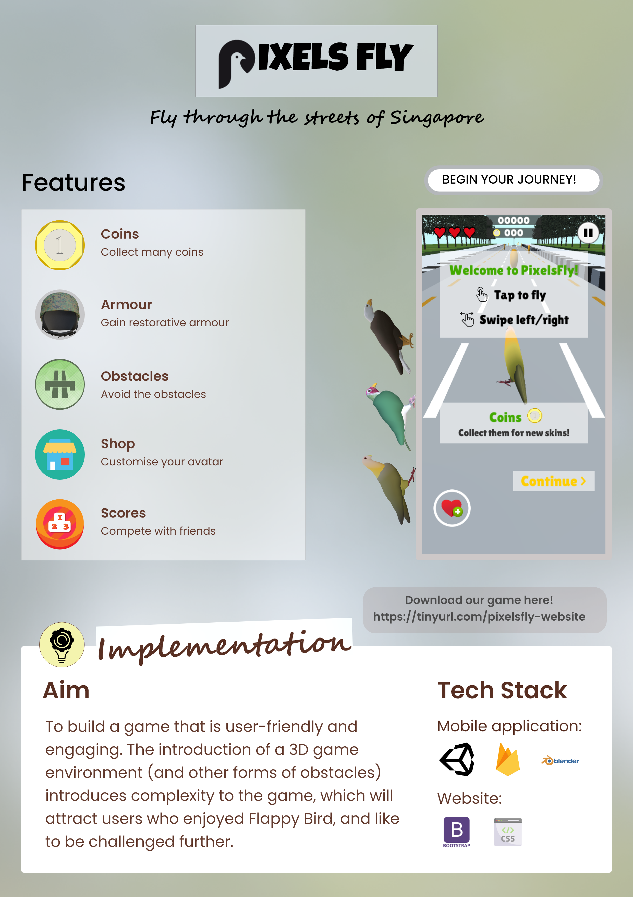

<h1 align="center">Welcome to Pixels Fly! 👋</h1>

<i>Made by: Ang Zheng Yong, Neo Rui En Maybelline</i>

## **Introduction**

**Pixels Fly** is a crossover of the all-time favourite indies: Flappy Bird and Temple Run. In this game, we recreated the gameplay of the extremely addictive game Flappy Bird in a 3D world, with each round of the game lasting not more than a few minutes (depending on the player’s skills). With its simple yet enjoyable game mechanics, we hope that it could attract both game-lovers and casual users, and help them momentarily relieve their stress.

## **The Game**

Pixels Fly is Singaporean-themed. Tap the screen to fly, swipe the screen to switch between lanes. Players would begin with a tutorial which ends after they reach a score of 80.

This is the poster that we designed for the game. The main features and implementation details of the game are highlighted in the poster. The 3 birds perching on the gameplay picture are the various **Pixels Fly** avatars -- each of them has their own unique skill!

**Pixels Fly** brings you on a journey along the Singaporean roads. Collect coins and protective armour, while avoiding collisions into traffic lights, signboards, MRT trains! Beware -- a certain machine awaits you for your bird tax. Here are some screenshots of the **Pixels Fly** game. Find the machine in the screenshots below! *(it is pretty well hidden)*

## **Links**

Download our Android apk [here](https://drive.google.com/file/d/1DL0Vq2s2D7yjXYHJ4PTvAKkDIhOA-Ltd/view?usp=sharing).

Check out our website [here](https://sharp-bardeen-b329fe.netlify.app/).

## **Acknowledgements**

This project is developed as part of [NUS CP2106: Independent Software Development Project](https://orbital.comp.nus.edu.sg/).